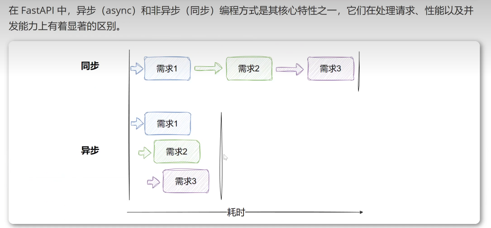

### 异步(async def)
事件循环:异步代码运行在 Python 的异步事件循环(如 asyncio)中。事件循环负责协调多个协程(coroutines)，在某个协程等待 1/0 操作(如数据库査询或 HTTP 请求)时，事件循环可以切换到其他协程执行。
非阻塞:当一个异步函数调用 await，它会暂停执行，将控制权交回事件循环，允许其他任务运行，直到等待的操作完成。
并发性:异步模式允许单个线程处理大量并发请求，特别适合高并发场景(如 Web 服务器处理大量客户端请求)。

非异步(def)
阻塞式执行:同步函数在调用时会完全占用线程，直到函数执行完成才会释放线程。
线程池:在 FastAP|中，同步函数由工作线程(worker threads)处理, Uvicor (FastAPI常用的 ASG服务器) 会将同步函数放入线程池运行。
并发限制:线程池的大小限制了同步函数的并发能力。如果线程池耗尽(例如，处理大量阻塞请求)，新请求将排队等待。